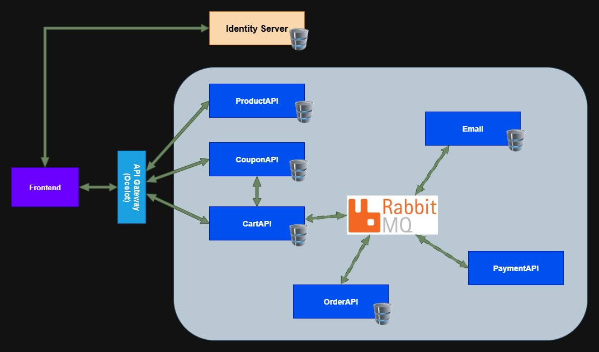

# GeekShopping Microservices

This project represent an eShop for geeks. Was created to trainning microservices knowledges, based on [Leandro Costa Repository](https://github.com/leandrocgsi/erudio-microservices-dotnet6)



## How to execute application?

```bash
# Build each microservice docker image
docker build -f docker/api-gateway.dockerfile -t api-gateway . &&
docker build -f docker/product-api.dockerfile -t product-api . &&
docker build -f docker/cart-api.dockerfile -t cart-api . &&
docker build -f docker/coupon-api.dockerfile -t coupon-api . &&
docker build -f docker/order-api.dockerfile -t order-api . &&
docker build -f docker/payment-api.dockerfile -t payment-api . &&
docker build -f docker/frontend.dockerfile -t frontend .

# Run docker compose
docker compose up
```

## APIGateway

- Gateway of microservices, implemented with [Ocelot](https://www.nuget.org/packages/Ocelot), requested by frontend project

## ProductAPI

- To manage products for sale on eShop.

## CartAPI

- Save cart and details to place orders, publishing a cart checkout message on RabbitMQ queue.

## CouponAPI

- To request coupon discounts.

## OrderAPI - Working Progress

- Service to consume the cart checkouts queue in order to prepare the order.

## PaymentAPI - Working Progress

## Email - Working Progress

## Identity Server - Working Progress